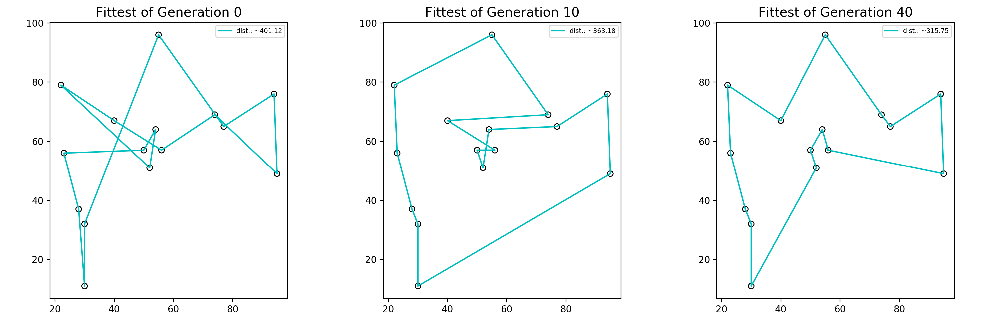

# Genetic Algorithm applied to the Traveling Salesman Problem
 

[`paper.ipynb`](paper.ipynb) notebook has all the explanations regarding Genetic Algorithms and how they are used to solve the Traveling Salesman Problem.

[`src/genetic.py`](src/genetic.py) file works as a library with the __Points__, __Route__ and __Population__ classes available to import in other files (such as the jupyter notebook above).

## Preferred run method
It is _not recommended_ to run the algorithm within the jupyter notebook for performance and other visual reasons (just doesn't look nice).

On the binder, the plots, instead of updating, simply appear one under the the other. Please allow __up to 5 minutes__ for the binder server to launch.

On your own machine, when running __in the CLI__, please ensure that that you remove `jupyter=True` and pass in `animate=True` for the plotting function.
